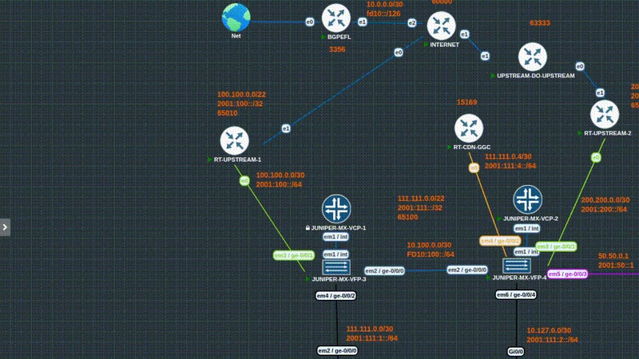

# BGPEFL – BGP Easy for Labs

[Read in 🇺🇸 English](/docs/README.en.md)

Aplicação escrita em **Go** para facilitar a criação de sessões **BGP** e a injeção de prefixos reais de um ASN (via IRR) em ambientes de laboratório como **EVE-NG** e **PnetLab**.

Ideal para simular cenários realistas de roteamento usando prefixos públicos reais sem precisar configurar manualmente centenas de rotas.

---

## 🚀 Demonstração

<p align="center">
  
</p>

## 📦 Sobre o Projeto

O **BGPEFL (BGP Easy for Labs)** permite:

- ✅ Subir uma sessão BGP rapidamente
- ✅ Buscar prefixos reais de um ASN via IRR (ex: `whois.radb.net`)
- ✅ Injetar rotas automaticamente no GoBGP
- ✅ Limpar RIB facilmente
- ✅ Controlar o ciclo de vida da aplicação

Ele utiliza o **GoBGP (`gobgpd`)** como daemon BGP.

---

## 🔧 Requisitos

- Linux
- Golang instalado (1.23+)
- GoBGP instalado (`gobgpd`)
- Permissões root (para manipulação de IP/interface)
- Conectividade com servidor IRR (padrão: `whois.radb.net`)
- Ambiente de lab como:
  - **EVE-NG**
  - **PnetLab**

---

## 🚀 Instalação

Inicie no EVE/PNETLAB um node com Linux (debian/ubuntu por exemplo) com no mínimo 2 interfaces:

* Uma conectada a Internet 
* Outra para a sessão BGP. 

Vocẽ pode compilar, utilizar o binário já compilado ou usar o BGEPFL Appliance.

## Compilar

```bash
git clone https://github.com/jeffersonraimon/bgpefl.git
cd bgpefl
go build -o bgpefl
cp bgpefl /usr/bin/bgpefl
```
## Binário já pronto (necessário instalar o GoBGPD)

```bash
wget https://github.com/jeffersonraimon/bgpefl/releases/download/v1.0.1/bgpefl
apt install gobgpd
chmod +x bgpefl
mv bgpefl /usr/bin/bgpefl
```
## BGPEFL Appliance

Imagem qemu leve do Alpine 3.20.3 já com o BGPEFL v1.0.1 instalado e pronto para uso

***Login:***
`root / sem senha

Link: [Google Drive](https://drive.google.com/drive/folders/1foE3TapBS79ivoQPwXhtTe_KKDz1Sb1K?usp=sharing)

### Como instalar
- Adicione a pasta em `opt/unetlab/addons/qemu/` 
- O `.yml` em `pt/unetlab/html/templates/amd` ou `/opt/unetlab/html/templates/intel`
- Dê permissão com `/opt/unetlab/wrappers/unl_wrapper -a fixpermissions`

##  📌 Uso Geral
```bash
bgpefl [command]
```
Comandos disponíveis:

| Comando |	Descrição |
| --------| --------- |
| init	| Inicializa sessão BGP para lab |
| gen	| Gera rotas BGP baseadas em IRR |
| clearrib	|Limpa RIB do BGPEFL |
| status	| Mostra status do BGPEFL |
| stop	|Para o BGPEFL |
| help	|Ajuda |

## 🔹 init – Inicializar Sessão BGP

Cria a sessão BGP, configura IP na interface e sobe o gobgpd.

Uso:
```bash
bgpefl init --ip <IP> --cidr <CIDR> --int <INTERFACE> \
            --local-as <LOCAL_AS> \
            --neighbor <NEIGHBOR_IP> \
            --remote-as <REMOTE_AS> \
            [--router-id <ROUTER_ID>]
```
Flags obrigatórias:
|Flag	|Descrição|
| ------ | ------ |
|--ip	|Endereço IP da interface|
|--cidr	|Máscara CIDR|
|--int	|Interface|
|--local-as	|ASN local|
|--neighbor	|IP do vizinho|
|--remote-as	|ASN remoto|

Exemplo:
```bash
bgpefl init \
  --ip 192.168.0.2 \
  --cidr 30 \
  --int eth0 \
  --local-as 65001 \
  --neighbor 192.168.0.1 \
  --remote-as 65000
```
## 🔹 gen – Gerar Prefixos via IRR

Busca prefixos de um ASN em um servidor IRR e injeta no GoBGP.

Uso:
```bash
bgpefl gen --as <ASN> [flags]
```

Flags:
|Flag	|Descrição|
| ------ | ------ |
|--as	|ASN para buscar prefixos|
|--irr	|Servidor IRR (default: whois.radb.net)|
|--dry-run	|Apenas mostra, não injeta|
|--limit	|Limite total de prefixos|
|--limit-v4	|Limite IPv4|
|--limit-v6	|Limite IPv6|
|--min-v4	|Prefixo mínimo IPv4|
|--min-v6	|Prefixo mínimo IPv6|
|--only-v4	|Apenas IPv4|
|--only-v6	|Apenas IPv6|

Exemplo:
```bash
bgpefl gen --as 15169 --limit 100
```
Modo simulação:
```bash
bgpefl gen --as 13335 --dry-run
```
## 🔹 clearrib – Limpar Rotas

Remove rotas atualmente injetadas no GoBGP.

Uso:
```bash
bgpefl clearrib [flags]
```
Flags:
|Flag	|Descrição|
| ----- |-------- |
|--soft	|Remove rota por rota (default)|
|--force	|Usa del all direto|
|--ipv4	|Remove apenas IPv4|
|--ipv6	|Remove apenas IPv6|

⚠️ Se o gobgpd não estiver rodando, o comando retornará erro.

## 🔹 status – Ver Status

Mostra o estado atual do BGPEFL e informações do GoBGPD.
```bash
bgpefl status
```
Exemplo de saída:
```bash
========== BGPEFL STATUS ==========
gobgpd: STOPPED
====================================
```
## 🔹 stop – Parar BGPEFL

Finaliza o gobgpd e pode opcionalmente limpar rotas e remover IP da interface.

Uso:
```bash
bgpefl stop [flags]
```
Flags:
|Flag |	Descrição|
| ---- | ------- |
|--clear-rib	|Remove todas as rotas|
|--force	|Força kill do processo|
|--remove-ip	|IP a remover|
|--remove-cidr	|CIDR do IP|
|--remove-int	|Interface para remover IP|

Exemplo:
```bash
bgpefl stop --clear-rib --force
```
Removendo IP da interface:
```bash
bgpefl stop \
  --remove-ip 192.168.0.2 \
  --remove-cidr 30 \
  --remove-int eth0
```
## 🧠 Fluxo Recomendado

Inicializar sessão BGP:
```bash
bgpefl init ...
```

Gerar prefixos:
```bash
bgpefl gen --as <ASN> --limit 20
```

Verificar status:
```bash
bgpefl status
```

Limpar rotas (se necessário):
```bash
bgpefl clearrib
```

Parar ambiente:
```bash
bgpefl stop
```
## 🧪 Casos de Uso

- Laboratórios de BGP em EVE-NG / PNETLAB

- Testes de políticas BGP

- Estudo de filtros e route-maps

- Testes de RPKI e validação de origem

- Treinamento para certificações (ex: CCNP/CCIE/JNCIP)

## ⚠️ Aviso

Este projeto é destinado exclusivamente para ambientes de laboratório.

Não utilize para:

- Anunciar prefixos reais na Internet

- Testes em ambientes de produção

- Cenários sem controle de roteamento

## 📄 Licença

Licença MIT
